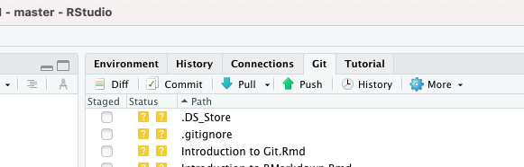

```{r setup, include=FALSE}
knitr::opts_chunk$set(echo = FALSE)
```

## This Lecture {.build}

1. What is Git, and why should you use it?
2. Basics of Git.

Where to find these slides: [github.com/jcockayne/math3092_2021](https://github.com/jcockayne/math3092_2021).

Further reading: [happygitwithr.com](https://happygitwithr.com).


# What is Git, and why should you use it?

## What is Git? {.build}

Git is software for *version control*.
It helps you to keep track of how files have changed over time.

## Why should I use Git? {.build}

* Version control **is worth the price of admission**.
  - If you write software, you *will* sometimes break it while making changes.
  - Every time you break it, you will thank your past self for learning git, so you
  can easily undo your mistake.
* Back up - git is seamlessly integrated with github, and github will back up your code for free.
* Collaboration - working on software as a team is impossible without version control.
* Development - any future job that involves writing software will be using version control.
* Exposure - code on github can be seen and re-used by anyone. A strong git presence
  can be good for your CV!
  
Git is *not just for code* but it works best with *text files* (e.g. LaTeX files).

## What's the catch? {.build}

Git is a complex piece of software that can be difficult to get used to, and
when it goes wrong it can be difficult to fix.

Getting used to it now will save future headaches.

# Basics of Git

## How to Use Git {.build}

Git is, at its core, a command line tool, and doing everything from the terminal
is possible.

*However* git clients exist, both standalone and integrated with IDEs (such as `RStudio`).

Recommended git clients:
1. [GitKraken](https://www.gitkraken.com)
2. [SourceTree](https://www.sourcetreeapp.com)

## Git Life {.build}

Initial setup:

* Create a repository on github.
* Follow the instructions on the new repository.
* "Clone" the repository to your PC.

Git workflow:

* "Pull" the latest code from github to a local folder on your computer.
* Change the code, as you would usually
* "Add" changed files to the commit staging area.
* "Commit" the changes
* "Push" the commit(s) back to github.

There are more advanced "git verbs" - but these should be enough for anyone working
solo on a project.


## Using Git in RStudio

You can clone a project from `File > New Project > Version Control > Git`

.

# Conclusion 

## Conclusion {.build}

We've seen:

* Why you should be using git.
* The simple git workflow.

Getting help:

Git is one of the most widely used pieces of software on earth --- googling 
often yields results. Also:

* [Happy Git with R](https://happygitwithr.com/rstudio-git-github.html)


