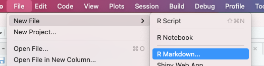
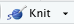

```{r setup, include=FALSE}
knitr::opts_chunk$set(echo = FALSE)
```

## This Lecture {.build}

1. What is R Markdown, and why should you use it?
2. A (very) quick introduction.

Where to find these slides: [github.com/jcockayne/math3092_2021](https://github.com/jcockayne/math3092_2021).

Further reading: [r4ds.had.co.nz](https://r4ds.had.co.nz/communicate-intro.html), 
sections 26-30.

# What is R Markdown, and why should you use it?

## R Markdown {.build}

R Markdown is a file format that combines `markdown` with `R` code to produce what
are called "interactive documents".

* Interactive documents provide a way for you to embed your code inside the report
you write to accompany it.
* The goal is *reproducibility* - to ensure that statistical results you produce
can be *re*produced by any consumers.
* Reproducibility is a *big problem* 
  - In science we are in the midst of an [irreproducibility crisis](https://doi.org/10.1038/533452a).
  - In the USA, estimates say that irreproducibility [costs $28 billion annually](https://doi.org/10.1371/journal.pbio.1002626).
  
R Markdown files are *plain text* files that need to be "knitted" to produce a document
(e.g. `.pdf` or `.html`).

## What is Markdown? {.build}

Markdown is a simple way to create text that can be rendered into another document.
Simple examples:

<div style="float: left; width: 50%">
**Input:**
```
**bold** *italic*

- bulleted list
- bulleted list

1. numbered list
2. numbered list


Math: $\exp(i\pi) = -1$ and display math:

$$exp(i\pi) = -1$$
```
</div>
<div style="float: right; width: 50%">
**Output:**

**bold** *italic*

> - bulleted list
> - bulleted list

> 1. numbered list
> 2. numbered list

Math: $\exp(i\pi) = -1$ and display math:
$$exp(i\pi) = -1$$
</div>

## What is an R Markdown Document? {.build}

* An R Markdown document is just a markdown document with some extra features.
* They are plain text files with extension `.Rmd`.
* They need to be "knitted" in `RStudio` to generate readable output.
  - The output can be `.html` or `.pdf`, but there are many other options.

If you have RStudio you already have R Markdown:


# Including R Code


## Code Chunks in R Markdown Documents {.build}

R Markdown makes mixing `R` code with your markdown easy:

<div style="float: left; width: 50%">
  **For this input:**
  
  ```{r eval=TRUE}`r ''`
  
  x = rnorm(1)
  
  x # output is automatically displayed
  ```
</div>
<div style="float: right; width: 50%">
  **Only this output appears:**
  ```{r}

  x = rnorm(1)
  x # output is automatically displayed
  ```
</div>

## Code Chunk Options {.build}

Code chunks can have options, e.g. `{r eval=TRUE}` which modify their behaviour:

* `{r eval=FALSE}`: prevent this code block from being evaluated when knitted.
* `{r echo=FALSE}`: stop the source code from appearing in the knitted document.
* `{r label='chunk-name'}` (or just) `{r chunk-name}`: isolate the variables in this
chunk from the scope in the rest of the document.

Descriptions of more at [https://yihui.org/knitr/options/](https://yihui.org/knitr/options/).

## Using R in R Markdown Documents {.build}

You can also evaluate `R` code inline in text.
For example, you can display the value of `x` (defined on the previous slide) 
by typing:
`` `r
x` ``
which yields `` `r x` ``.

## Plotting 

If a code chunk outputs a graph, it is automatically rendered to the document:

```{r graph}
  library(ggplot2)
  xs = seq(from=-2, to=2, by=0.1)
  ys = xs*xs
  df = data.frame(x=xs, y=ys)
  ggplot(data=df, aes(x=x, y=y)) + 
    geom_line()
```

## Generating output {.build}

To generate the output `.html` or `.pdf` file, just click 

in the toolbar.

The dropdown allows you to choose the output type, either `.html` or `.pdf`.

# Conclusion

## Conclusion {.build}

We've seen how to create an R Markdown document and simple examples of the syntax.
The best way to learn is to use them!

There is a wide community of R Markdown users - googling your problem will
often help.

Other excellent resources:

* [RMarkdown Cookbook](https://bookdown.org/yihui/rmarkdown-cookbook/)
* [R for Data Science - "Communicate" section](https://r4ds.had.co.nz/communicate-intro.html)

